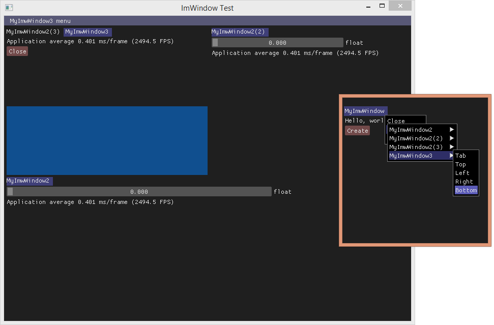
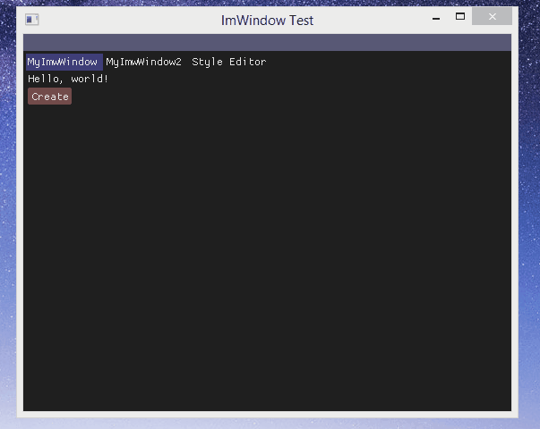

# ImWindow

Window and GUI system based on ImGui from OCornut.

Include docking/floating window, multi window and multi render support.

#License
ImWindow is licensed under the MIT License, see LICENSE for more information.
